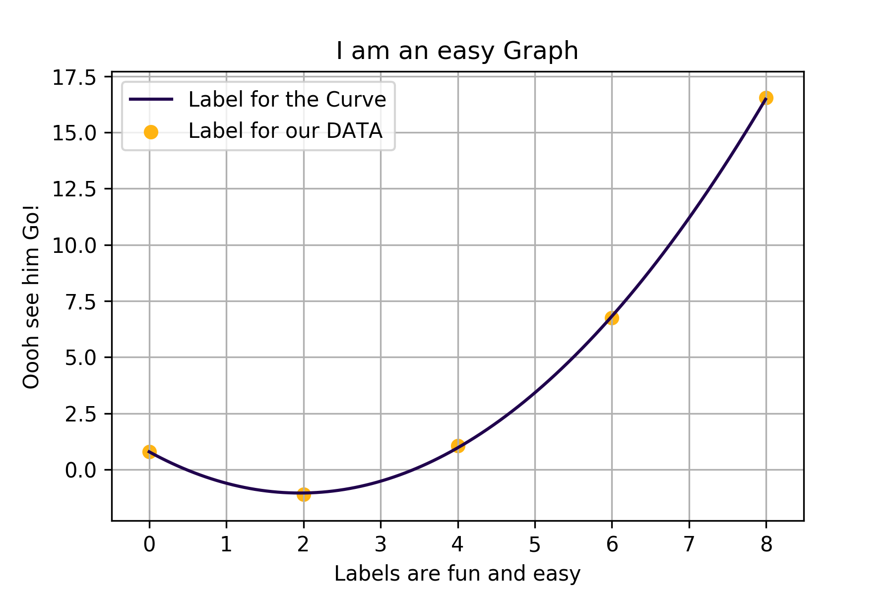

<div align="center">
    <h1>
        xyplot 📈
    </h1>
    
    <p>
        <i>Plotting with python made easy</i>
    </p>
</div>

[](https://saythanks.io/to/xypnox)    

Are you tired of replicating common steps that are needed to plot even a simple polynomial functions in python's infamous Matplotlib?

Worry no more! Presenting **xyplot**! Plot polynomials easily and, more importantly, pythonically!

For example, to plot a polynomial best fit curve you only need to:

```python
from xyplot import Curve

# Our data
x, y = [0, 2, 4, 6, 8], [0.8, -1.1, 1.06, 6.75, 16.54]

# A simple curve object with data and degree of polynomial
curve = Curve(x, y, 2)

# Set the x, y axis labels and Title
curve.set(
    xlabel = "Labels are fun and easy",
    ylabel = "Oooh see him Go!",
    title = "I am an easy Graph"
)

# Label our data and curve
curve.createPlot(
    plotLabel="Label for the Curve",
    dataLabel="Label for our DATA",
)

curve.save("sample.png") # Save our graph in high quality
```

Makes sense right? See `examples` for other examples.

> **Fair Warning**
>
> This is just a high level sensible wrapper to the matplotlib and numpy package. Its aim is to reduce the workload necessary to make very basic plots.
>
> To make more extensive and customizable plots, refer to [matplotlib](https://matplotlib.org/)

<div align='center' >
	
</div>

## Why this effort?

Some of the more inquistive and experienced would be asking why the hell did I create an entire package that can only plot polynomials. Because there was nothing similar in matplotlib and I wanted to help those who have only little knowledge of python plot amazing graphs in as few lines and headaches as possible.

For those who still like control, you always have the fig, ax attributes of the curve class available for exploitation! And then, if you are not satisfied, try the OG Matplotlib!

## Installation

To install the program run

```
$ pip install xyplot
```

If you are using Ubuntu run this instead:

```
$ pip3 install xyplot
```

To check whether the installation was successful, try importing it:

```python
from xyplot import Curve
```

If the import worked, the package is most probably installed.

Note that you may want to install some other python libraries to fully enjoy the _Scientific Python_ experience.

These are recommended:

```
$ pip install --user numpy scipy matplotlib ipython jupyter pandas sympy nose
```

## Documentation?

> Documentation is like sex: when it is good, it is very, very good; and when it is bad, it is better than nothing. — _Dick B._

With that said, the documentation can be found here: http://www.xypnox.com/xyplot/xyplot/index.html

## Contributions?

Are welcome!
